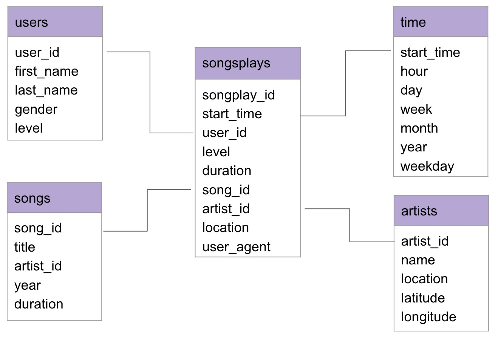

# Project : Data Warehouse

## Introduction 

Sparkify is a music streaming app. The analytics team want to understand what songs users are listening to. Having a well-structured Postgres database would be the starting point of a good use and analysis of data.

## 1. Goal

Be able to understand what the customer wants and provide him his needs is the mantra of great companies. That's why Sparkify wants to create a database that would be easy to manipulate and understand from an outside point-of-view. The Goal of this database is to facilitate processes and extraction for data analysis. This tables are designed to optimize queries on song play analysis. For this goal, they gathered 2 datasets. The first one is the **Song dataset** which is a subset from the Million Song Dataset. The second one is the **Log dataset** which gathered activity logs from the music streaming app based on specified configurations.

## 2. Database and project files 

Two datasets are used to build the tables :
### **Song Dataset**
Songs dataset is a subset of [Million Song Dataset](http://millionsongdataset.com/).

Sample Record :
```
{"num_songs": 1, "artist_id": "ARJIE2Y1187B994AB7", "artist_latitude": null, "artist_longitude": null, "artist_location": "", "artist_name": "Line Renaud", "song_id": "SOUPIRU12A6D4FA1E1", "title": "Der Kleine Dompfaff", "duration": 152.92036, "year": 0}
```

### **Log Dataset**
Logs dataset is generated by [Event Simulator](https://github.com/Interana/eventsim).

Sample Record :
```
{"artist": null, "auth": "Logged In", "firstName": "Walter", "gender": "M", "itemInSession": 0, "lastName": "Frye", "length": null, "level": "free", "location": "San Francisco-Oakland-Hayward, CA", "method": "GET","page": "Home", "registration": 1540919166796.0, "sessionId": 38, "song": null, "status": 200, "ts": 1541105830796, "userAgent": "\"Mozilla\/5.0 (Macintosh; Intel Mac OS X 10_9_4) AppleWebKit\/537.36 (KHTML, like Gecko) Chrome\/36.0.1985.143 Safari\/537.36\"", "userId": "39"}
```

## **Project files**

```sql_queries.py``` : This script contains SQL queries in order to drop, create and insert tables.

```create_tables.py``` : This script contains functions for setting up database. Running this file creates **sparkifydb** database, drop the tables if they already exist and create new tables from ```sql_queries.py```. 

```etl.ipynb``` : This Jupyter Notebook is used to analyse both datasets before loading them into the tables. 

```etl.py``` : This script is the automation process of ```etl.ipynb```, it reads and loads **song_data** and **log_data**.

```test.ipynb``` : This Jupyter Notebook connects to Postgres database and validates the data loaded.


## 2. Database schema design and ETL pipeline

The project is divided into 3 important steps :
- Create tables with a star schema 
- Building ETL processes 
- Building ETL pipe


1. Create tables with a star schema 



The project is composed of one fact table and four dimension tables. The fact table, named _songplays_, records in log data associated with song plays. This table provides the metrics of the data I want to extract. The dimension tables provide information related to different dimensions of the fact table, such as _users_, _songs_, _artists_ and _time_ which records respectively the users, the songs, the artists and the timestamp of records in _songplays_ broken down into different units. 

So the create tables, multiple CREATE statements have been written in sql_queries.py and called into create_tables.py. In order to be able to reset the database, DROP statements have been created for all the tables. When running create_tables.py, I make sure that all the tables are dropped and then recreated from scratch and empty after connecting to sparkify database.  I can see in the _songplays_ tables that the unique primary key for each dimension table is included in the fact table. 

## Schema for Song Play Analysis

#### Fact Table
songplays - records in event data associated with song plays.

    songplay_id, start_time, user_id, level, song_id, artist_id, session_id, location, user_agent

#### Dimension Tables 
##### users

    user_id, first_name, last_name, gender, level
##### songs

    song_id, title, artist_id, year, duration

##### artists

    artist_id, name, location, lattitude, longitude

##### time

    start_time, hour, day, week, month, year, weekday

2. Building ETL processes 

In order to test the data from *Song* and *Log* *datasets*, I run some test on etl.ipynb notebook. In this notebook, all the files from both datasets are extracted and processed to be then inserted into the right table. As the datasets are json files, they are loaded with pandas package and processed as a DataFrame to a list to be inserted via execution of a query through Postgres._songs_ and _artists_ tables are filled from *Song* *dataset* and _time_ and _users_ table are completed with *Log* *dataset*. In order to fill in _songplays_ table, both datasets are needed and to get the song ID and artist ID, I needed to query the songs and artists tables to find matches based on song title, artist name, and song duration time. During the whole exercice on this notebook, a connection was created to communicate with Sparkify database and then closed before ending the jupyter notebook. Next, to explore the database, a few lines of SELECT queries are tested into test.ipynb to see if the data is actually filled with etl.ipynb.

3. Building ETL pipe

Finally, after testing etl.ipynb with test.ipynb I am ready to build the ETL pipe to automate the whole process. In this script, there are three important functions which are : process_song_file(), process_log_file() and process_data() and the whole script is executed as follows : 
- A connection is created with Sparkify database.
- All the files from *Song* *dataset* are extracted and enumerated.
- Thoses files are processed one-by-one with the process_song_file() function. 
- All the files from *Log dataset* are extracted and enumerated. 
- Those files are processed one-by-one with the process_log_file() function. 
- The connection is closed. 

After building this ETL pipe, all the tables are filled in with *Song* and *Log* *datasets* and the database is ready to use. 

## 3. Environment 

Python 3.6 or above

PostgresSQL 9.5 or above

psycopg2 - PostgreSQL database adapter for Python


## 4. How to Run

1. Create an IAM Role for Amazon Redshift.
2. Launch a Sample Amazon Redshift Cluster.
3. Authorize Access to the Cluster with a VPC Security Group.
4. Connect to the Sample Cluster and Run Queries.
5. Add Key and Secret from Sample Cluster in ```create_tables.py```
6. Create a dwh.cfg file.
    File format for **dwh.cfg**
```
$ cat > dwh.cfg
[CLUSTER]
HOST=host_name
DB_NAME=db_name
DB_USER=db_user
DB_PASSWORD=db_pwd
DB_PORT=5439

[IAM_ROLE]
ARN=<IAM Role arn>

[S3]
LOG_DATA='s3://udacity-dend/log_data'
LOG_JSONPATH='s3://udacity-dend/log_json_path.json'
SONG_DATA='s3://udacity-dend/song_data'
```
7. Run following python scripts.
#### Create tables

    $ python create_tables.py

#### Extract, Transform and Load the Data

    $ python etl.py


Reference: [AWS Redshift Doc](https://aws.amazon.com/redshift/getting-started/?p=rs&bttn=hero&exp=b)
